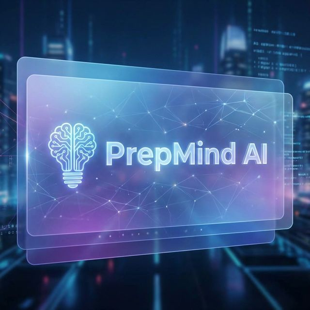

# 🧠 PrepMind AI
> **Accept No Limits. Master Your Exam.**



**PrepMind AI** is a cutting-edge, AI-powered exam preparation platform designed for serious aspirants of **UPSC, JEE, and NEET**. We combine advanced Generative AI with rigorous testing protocols to provide a holistic preparation ecosystem—from high-stakes mock interviews to adaptive subject tests.

---

## 🚀 Key Features

### 1. 🎙️ AI-Powered UPSC Interview Board
Experience the pressure of a real Civil Services Personality Test from the comfort of your home.
*   **Real-Time Voice Interrogation**: Powered by **Google Vertex AI** and **Gemini 2.5**, our AI interviewer conducts full voice-based interviews with <200ms latency.
*   **Adaptive Questioning**: The AI analyzes your DAF (Detailed Application Form) profile to ask personalized, probing questions.
*   **Strict Persona ('Charon')**: A no-nonsense interviewer personality that mocks the strictness of a real UPSC board.
*   **Live Conduct Monitoring**: The system automatically detects unprofessional language or aggression and terminates the interview immediately, enforcing discipline.
*   **Detailed Analytics**: Post-interview feedback on *Communication, Critical Thinking, Knowledge, and Professionalism*.

### 2. 📝 Multi-Stream Mock Tests (JEE & NEET)
Comprehensive testing engine for engineering and medical aspirants.
*   **Full-Length Mocks**: Complete 3-hour simulations for **JEE Mains/Advanced** and **NEET**.
*   **Subject-Wise Tests**: Targeted practice for Physics, Chemistry, Mathematics, and Biology.
*   **Custom Test Generator**: Create your own test by selecting specific topics, difficulty levels, and number of questions.
*   **Real-Exam Interface**: Familiar UI that mimics the actual NTA CBT (Computer Based Test) environment.

### 3. 📊 Intelligent Dashboard & Analytics
Your central command center for preparation.
*   **Performance Tracking**: Visual graphs showing score trends, accuracy rates, and time management.
*   **Smart Recommendations**: AI-driven suggestions on weak areas (e.g., "Focus more on Rotational Mechanics").
*   **Test History**: Access detailed solutions and reviews for every past attempt.

### 4. 🎨 Premium User Experience
*   **Glassmorphism Design**: A sleek, modern UI inspired by macOS, featuring frosted glass effects and smooth transitions.
*   **Fluid Animations**: Custom-built CSS animations, including the "Liquid Morph" AI avatar.
*   **Dark Mode**: Fully supported system-wide dark theme for late-night study sessions.

---

## 🛠️ Technical Architecture

PrepMind AI is built on a robust, event-driven architecture designed for speed and scalability.

### **Frontend**
*   **Core**: HTML5, Vanilla JavaScript (ES6+), CSS3.
*   **Styling**: Custom CSS Variables, Flexbox/Grid, Glassmorphism effects.
*   **Auth**: **Firebase Authentication** (Google Sign-In integration).
*   **State Management**: LocalStorage & Custom Event Bus.

### **Backend**
*   **Runtime**: **Node.js** environment.
*   **Framework**: **Express.js** for RESTful APIs.
*   **Real-Time**: **WebSocket (`ws`)**     for full-duplex low-latency audio streaming.
*   **AI Integration**:
    *   **Google Vertex AI**: For text-to-speech and speech-to-text streams.
    *   **Gemini 2.5 Flash**: For intelligence, reasoning, and transcript generation.

### **Project Structure**
```text
PrepMind-AI/
├── backend/
│   ├── ai_gen/        # Python AI Agents (Gemini Logic)
│   ├── src/
│   │   ├── websocket/     # Real-time Audio Stream Handler
│   │   ├── routes/        # API Routes (Interview, Analysis)
│   │   ├── services/      # Vertex AI & Gemini Integrations
│   │   └── controllers/   # Request Logic
│   ├── build.sh           # Custom Render Build Script
│   └── server.js          # Entry Point
│
├── frontend/
│   ├── src/
│   │   ├── assets/        # Styles and Branding
│   │   ├── js/
│   │   │   ├── config.js  # Environment Configuration
│   │   │   ├── components/# Reusable UI
│   │   │   └── pages/     # Page Logic
│   └── index.html         # Landing Page
│
├── render.yaml            # Render Deployment Blueprint
├── vercel.json            # Vercel Configuration
└── DEPLOYMENT.md          # Detailed Deployment Guide
```

---

## ⚡ Quick Start Guide

### Prerequisites
*   Node.js (v16 or higher)
*   Python 3.9+ (for AI modules)
*   Google Cloud Project with **Vertex AI API** enabled.

### 1. Clone the Repository
```bash
git clone https://github.com/yourusername/PrepMind-AI.git
cd PrepMind-AI
```

### 2. Setup Backend (Hybrid Node.js + Python)
```bash
cd backend
# Install Node dependencies
npm install

# Install Python dependencies
pip install -r requirements.txt
```

Create a `.env` file in the `backend/` directory:
```env
PORT=5000
GOOGLE_CLOUD_PROJECT=your-gcp-project-id
# Option A: Local File Path
GOOGLE_APPLICATION_CREDENTIALS=path/to/your/service-account.json
# Option B: JSON Content (Better for Render/Production)
GOOGLE_APPLICATION_CREDENTIALS_JSON={"type": "service_account", ...}
```

Start the server:
```bash
npm start
# Output:
# ✅ Server running on port 5000
# 🎤 Interview WebSocket available at ws://localhost:5000/interview
```

### 3. Setup Frontend
Simply serve the `frontend` folder using any static file server.
*   **VS Code**: Right-click `frontend/index.html` -> "Open with Live Server".
*   **Python**: `cd frontend && python3 -m http.server 8000`

Visit `http://127.0.0.1:8000` to start using PrepMind AI.

---

## 🌐 Deployment

### Zero-Cost Production Deployment

PrepMind AI can be deployed for **$0/month** using free tiers:

- **Backend**: Render Free Tier (with WebSocket support)
- **Frontend**: Vercel Free Tier
- **Keep-Alive**: Cron-job.org (prevents backend sleep)

📖 **[Complete Deployment Guide →](DEPLOYMENT.md)**


The deployment guide includes:
- Step-by-step Render backend setup
- Vercel frontend deployment
- Cron-job.org pinger configuration
- Environment variables reference
- Troubleshooting tips

---

## 🔒 Security & Performance
*   **Firebase Auth**: Secure, token-based authentication session management.
*   **Rate Limiting**: Backend protection against API abuse.
*   **Optimized Assets**: Minified critical CSS and lazy-loading for non-essential scripts.
*   **Audio Buffering**: Custom binary processing to handle unstable network conditions during interviews.

---

## 🤝 Contributing
We welcome contributions! Please follow these steps:
1.  Fork the project.
2.  Create your feature branch (`git checkout -b feature/AmazingFeature`).
3.  Commit your changes (`git commit -m 'Add some AmazingFeature'`).
4.  Push to the branch (`git push origin feature/AmazingFeature`).
5.  Open a Pull Request.

## 📄 License
Distributed under the MIT License. See `LICENSE` for more information.

---
*Built with ❤️ by the PrepMind Team.*